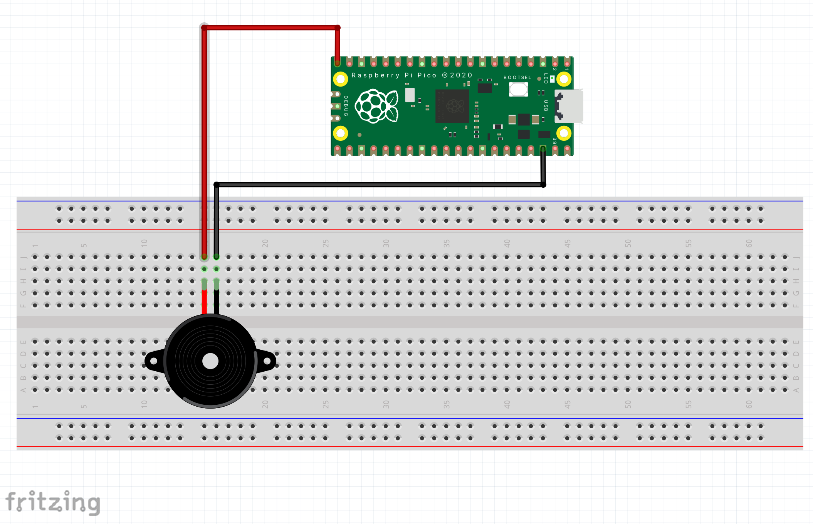

# Canciones Raspberry pi pico
 
Este es un programa simple que se hizo específicamente para raspberry pi pico, cada carpeta contiene los archivos que deben ser guardados dentro de la memoria interna del dispositivo, el archivo main.py siempre es el que se ejecutará automáticamente dentro del raspberry. 
 
## Hardware
 
- 1 Raspberry pi pico
- 1 Buzzer pasivo. <--- PILAS DEBE SER PASIVO ----> el activo solo suena con un tono determinado
- 2 cables de conexión 
El buzzer debe ser conectado al pin GND y el PIN 15 del raspberry pi pico.

AGREGAR IMAGEN !!!!

## Listado de canciones 

### Movies
* [Imperial March from Star Wars](https://github.com/sfiro/RaspberryPIPICO-Songs/blob/main/ImperialMarch/main.py)
* [Hedwig's theme from Harry Potter](https://github.com/sfiro/RaspberryPIPICO-Songs/blob/main/HarryPotter/main.py)

### Games
* [Super Mario Bros' overworld theme](https://github.com/sfiro/RaspberryPIPICO-Songs/blob/main/MarioBross/main.py)

### Others
* [Pink Panther Theme](https://github.com/sfiro/RaspberryPIPICO-Songs/blob/main/PinkPanter/main.py)
* [Take on me](https://github.com/sfiro/RaspberryPIPICO-Songs/blob/main/TakeOnMe/main.py)
* [Never Gonna Give You Up](https://github.com/sfiro/RaspberryPIPICO-Songs/blob/main/NeverGonnaGiveYouUp/main.py)

## Agradecimientos
Este código está basado en la gran librería creada para arduino y que tiene un listado de canciones impresionantes. 
Te invito a visitar y darle muchos likes, porque se nota el gran trabajo, yo solo lo adapté a Python. 

[Revisar] (https://github.com/robsoncouto/arduino-songs)

## Puedes visitar mis perfiles siempre estoy compartiendo INFO

* [Mi pagina WEB] (https://tutosingenieria1.blogspot.com/)

